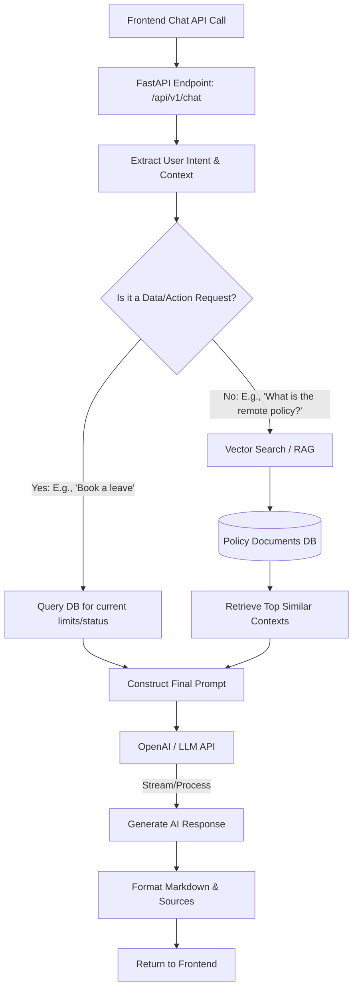

# AI HRMS Copilot - Backend

This is the backend service for the AI HRMS Copilot project, built with FastAPI, PostgreSQL, and Langchain.

---

## 🔗 Quick Links & Deployments

- **Frontend Repository:** [https://github.com/kuralnithi/CB_A2_HRMS_FRNTD](https://github.com/kuralnithi/CB_A2_HRMS_FRNTD)
- **Backend Repository:** [https://github.com/kuralnithi/CB_A2_HRMS](https://github.com/kuralnithi/CB_A2_HRMS)
- **Frontend Deployed Link:** [https://cb-a2-hrms-frntd.vercel.app](https://cb-a2-hrms-frntd.vercel.app)
- **Backend Deployed Link:** [https://cb-a2-hrms.onrender.com/docs](https://cb-a2-hrms.onrender.com/docs)

> [!NOTE]
> **Render Server Spin-up:** To spin up the backend server on Render (as it may sleep due to inactivity), simply open the backend deployment URL in your browser.

---

## 🌟 Overview

The backend acts as the core brain of the HRMS, providing secure REST APIs for frontend consumption and housing the advanced AI Copilot processing engine. 

## Gen AI Project

### HRMS

- [View the LinkedIn post for this HRMS project](https://www.linkedin.com/posts/kural-nithi-0b967122b_ai-generativeai-langchain-ugcPost-7465425438513938432-WNot/?utm_source=share&utm_medium=member_desktop&rcm=ACoAADmVtk0BmNqWq-K8895ZhmcAzBKhjfXB5oY)

### ✨ Key Features
- **FastAPI Core**: High-performance, asynchronous REST APIs.
- **JWT Authentication**: Secure role-based access control (Admin, Manager, Employee).
- **PostgreSQL Database**: Relational mapping using SQLAlchemy ORM for robust data integrity.
- **AI Processing Engine**: Integration with LLMs (OpenAI) via Langchain for dynamic natural language processing.
- **Retrieval-Augmented Generation (RAG)**: Context-aware document retrieval for answering specific company HR policies.

---

## 🏗️ System Architecture & Overall Flow

```mermaid
sequenceDiagram
    participant User
    participant NextJS as Next.js Frontend
    participant FastAPI as FastAPI Backend
    participant Auth as Auth Middleware
    participant DB as PostgreSQL
    participant AI as AI Engine

    User->>NextJS: Perform Action (e.g. view leaves)
    NextJS->>FastAPI: API Request with JWT Token
    FastAPI->>Auth: Validate JWT
    
    alt Invalid Token
        Auth-->>FastAPI: Unauthorized
        FastAPI-->>NextJS: 401 Error
        NextJS-->>User: Redirect to Login
    else Valid Token
        Auth-->>FastAPI: User Payload (ID, Role)
        FastAPI->>DB: Execute Query (ORM)
        DB-->>FastAPI: Data Result
        FastAPI-->>NextJS: JSON Response
        NextJS-->>User: Update UI
    end
```



---

## 🤖 AI Copilot Workflow

The backend handles the heavy lifting for the AI Copilot. When a user asks a question, the backend classifies the intent, queries relevant internal data, and constructs an augmented prompt for the LLM.



---

## 🚀 Getting Started & Local Setup

Follow these simple, step-by-step instructions to set up the backend service locally.

### 📋 Prerequisites

Before you start, ensure you have the following installed on your machine:
- **Python 3.9+**
- **PostgreSQL** (running locally or using a cloud database like Neon)
- **Redis** (running locally or using a cloud provider like Upstash)
- **LLM API Keys** (Groq and Gemini)
- **Qdrant Vector DB Account / Instance**

---

### ⚙️ Step-by-Step Installation Guide

#### 1. Clone the Repository & Navigate to Backend
If you haven't already, clone the repository and navigate into the `backend` directory:
```bash
git clone https://github.com/kuralnithi/CB_A2_HRMS.git
cd CB_A2_HRMS/backend
```

#### 2. Configure Environment Variables
We have provided a detailed template file containing all the configuration keys. Copy the `sample.env` to a new `.env` file:
```bash
cp sample.env .env
```
Now, open the `.env` file and replace the placeholder values with your actual database links and API keys.

#### 3. Create & Activate a Virtual Environment
It is highly recommended to isolate your dependencies using a Python virtual environment:

- **On Windows (PowerShell):**
  ```powershell
  python -m venv venv
  .\venv\Scripts\Activate.ps1
  ```
- **On Windows (Command Prompt):**
  ```cmd
  python -m venv venv
  .\venv\Scripts\activate.bat
  ```
- **On macOS / Linux:**
  ```bash
  python3 -m venv venv
  source venv/bin/activate
  ```

#### 4. Install Project Dependencies
With your virtual environment active, run the following command to install the required packages:
```bash
pip install --upgrade pip
pip install -r requirements.txt
```

#### 5. Database Initialization & Seeding

> [!IMPORTANT]
> **Manual Schema Creation Required**: Database tables are **not automatically created** when starting the application for the first time. Because the project uses **Alembic** to manage database versions, you must manually run the migration scripts to initialize the database tables and schema.

To initialize your local database schema and populate it with rich sample HR and project data, run the following three commands in order:

1. **Create the PostgreSQL Database**:
   Generates a new database called `hr_copilot` (requires your local PostgreSQL user to have database creation permissions):
   ```bash
   python create_db.py
   ```
2. **Apply Schema Migrations (Creates Tables)**:
   Runs all migration scripts in `alembic/versions` to automatically construct the tables, indexes, and foreign key relationships in your database:
   ```bash
   alembic upgrade head
   ```
3. **Seed the Database with Sample Data**:
   Populates the database tables with default departments, projects, employee profiles, support tickets, announcements, and default login credentials:
   ```bash
   python seed.py
   ```

#### 6. Start the FastAPI Development Server
You are now ready to launch the backend server! Run:
```bash
uvicorn app.main:app --reload
```

---

### 🔍 Verification & Interactive Docs

Once the server is running, the API will be locally served at:
- **Root URL:** `http://127.0.0.1:8000`
- **Swagger Interactive API Documentation:** [http://127.0.0.1:8000/docs](http://127.0.0.1:8000/docs) (Highly recommended for testing endpoints and viewing schemas)
- **Alternative ReDoc Documentation:** [http://127.0.0.1:8000/redoc](http://127.0.0.1:8000/redoc)
